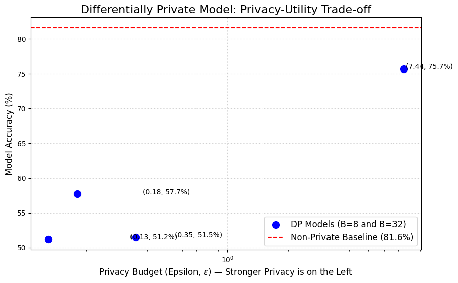

# Differentially Private Text Classifier (IMDB)

This project builds a sentiment analysis classifier for the IMDB dataset, trained with Differential Privacy (DP) using Opacus and Hugging Face. The goal is to measure the trade-off between model accuracy (utility) and the privacy budget (epsilon, $\epsilon$).

## Final Results: The Privacy-Utility Trade-off

The experiment clearly shows that as the noise multiplier ($\sigma$) increases, the privacy guarantee gets stronger (lower $\epsilon$), but the model's accuracy drops significantly. This demonstrates the core "privacy-utility trade-off."

### Results Table

| Experiment | Noise ($\sigma$) | Epsilon ($\epsilon$) | Accuracy |
| :--- | :---: | :---: | :---: |
| **Baseline** | N/A | $\infty$ | **81.60%** |
| DP (Weak) | 0.5 | 7.44 | 75.70% |
| DP (Strong) | 1.0 | 0.35 | 51.50% |
| DP (Stronger) | 1.5 | 0.18 | 57.70% |
| DP (Strongest) | 2.0 | 0.13 | 51.20% |
*(Note: Batch sizes were 32 for Baseline and $\sigma=0.5$, and 8 for $\sigma \ge 1.0$ due to GPU memory constraints)*

---

## Project Analysis

### 1. Objective
The goal of this project was to train a text classifier with Differential Privacy (DP) and measure the trade-off between model utility (accuracy) and privacy ($\epsilon$).

### 2. Baseline Performance
First, a non-private `distilbert-base-uncased` model was trained as a baseline. This achieved a maximum accuracy of **81.60%**. This represents the best possible utility with zero privacy.

### 3. DP-SGD Experimental Results
A series of models were then trained using DP-SGD with varying noise multipliers ($\sigma$). The results demonstrate a clear trade-off:

* **Weak Privacy (High Utility):** With a low amount of noise ($\sigma=0.5$), the model achieved a reasonable privacy budget of **$\epsilon=7.44$** and an accuracy of **75.70%**. This represents a small utility cost (a ~6% drop in accuracy) for a good privacy guarantee.
* **Strong Privacy (Low Utility):** As the noise multiplier was increased ($\sigma \ge 1.0$) to achieve a stronger privacy guarantee ($\epsilon \le 0.35$), the model's performance collapsed. Accuracy fell to a range of **51-58%**.
* **The "Privacy Cliff":** Since the baseline for random guessing on this dataset is 50%, an accuracy of 51-58% shows that the model was no longer learning meaningful patterns. The high level of noise required for strong privacy completely destroyed the model's ability to learn.

### 4. Conclusion
This experiment successfully demonstrates the privacy-utility trade-off. It shows that a practical level of privacy can be achieved with a minor loss in accuracy. However, it also proves that applying DP naively to achieve very strong privacy guarantees ($\epsilon < 1.0$) can make a model unusable, as the noise required for privacy overwhelms the learning signal.

## How to Run
This experiment was run in a Google Colab notebook (`DP-NLP-Experiment.ipynb`) with a T4 GPU. All required libraries can be installed via `pip install opacus transformers datasets scikit-learn matplotlib`.
